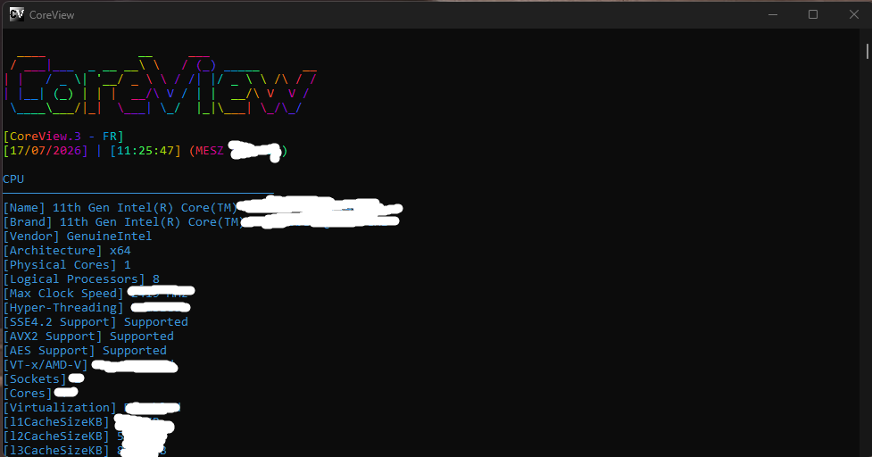
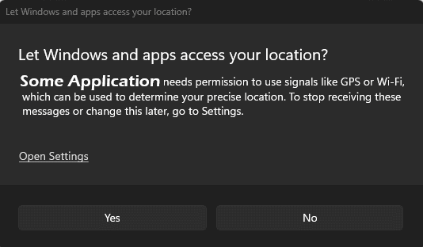

# CoreFramework & Installers
CoreFramework is the definition of all Core Projects, e.g. CoreView (This Project) and more upcoming ones.

You can find the CoreFramework Installer, which installs all components associated with CoreFramework on your pc [Here.](https://github.com/yummyzzzz/CoreInstaller) [Direct Install](https://github.com/yummyzzzz/CoreInstaller/releases/download/CoreInstaller/CoreInstaller.exe)

The Installer is essentially an Helper, but also an repair tool, if one of the Core Components is missing or corrupted.

# CoreView

CoreView is an intuitive, user-friendly C++ CLI system informer for **Windows** designed to provide deep insights into your hardware and operating system licensed under the EULA License.

## Overview

CoreView strips away the complexity of system monitoring, offering a clean interface to view your PC technical specifications and connected peripherals at a glance.

## Key Features

* Memory Analysis: View details for all RAM sticks individually.
* Processor and Graphics: Real-time data for CPU and GPU performance and specifications.
* Connectivity: Scan and list all devices connected via Bluetooth or physical cables.
* Storage Management: Detailed view of both internal and external storage drives.
* Network Intelligence: Comprehensive overview of network configuration and status.
* System Identification: View Windows OS details (Edition, Architecture, System Name, etc.).

## Getting Started

### Option 1: Quick Start
Download the latest pre-compiled .exe directly from the Releases page.

### Option 2: Build from Source
If you prefer to compile the source code yourself, ensure you have a C++ compiler installed, then follow these steps:

1. Clone the repository:
   `git clone https://github.com/yummyzzzz/CoreView.git`
2. Navigate to the directory:
   `cd CoreView`
3. Compile the project:
   Use your preferred build system (e.g., cmake . or your IDE build command).

## Why Use CoreView?

* Lightweight: Minimal system footprint compared to GUI-based alternatives.
* Fast: Get the information you need in milliseconds.
* Transparent: Open-source code allows you to verify exactly what data is being queried.

## Build Clarification
* FR = Full-Release (New & Stable Version)
* FC = Full-Custom (Stable but modified Version, e.g. RGB / NO RGB)
* PR = Pre-Release (un-stable but Early Version)

_You can always check the Version of the .exe when installing (Typically in the name) or by right-click > Properties > Details, for 2.3 builds, it will say 2.3.0.0_

_SILENT UPDATES MAY OCCURR IN THE FUTURE, WHICH ONLY AFFECTS THE INTERNAL CODE STRUCTURE._

## Feedback and Bug Reporting

This tool is currently in active development. If you find a bug, encounter a crash, or have a feature suggestion, please help us improve by reporting it:

* **Issue Tracker:** Please open a new issue on the [GitHub Issues page](https://github.com/Asterixss/CoreView/issues).
* **What Bug to report:** Please report an bug, if e.g. some Information is not shown, or something is wrong. (I have an Nvidia gpu but it says i have Intel?)
* **Information to Include:** When reporting a bug, please include the following Information:
  - CPU
  - GPU (Nvidia RTX 50.., etc.)
  - Windows (x64, Windows Enterprise, etc.)
  - Screenshot
  - CoreView Version (You can find the CoreView version ALWAYS under the banner, e.g. [CoreView.1 - FR])
   
* **Review Process:** A *CoreView* developer may reach out to request additional information if needed.

We appreciate your contributions in making CoreView more stable and reliable.

**Some hardware queries require elevated privileges. Because CoreView accesses detailed system information, some security software may request confirmation before execution.**

**CoreView requires Access for signals like Wi-Fi, this can trigger an Windows Privacy Location Popup, which asks you for permission. You can safely deny it, but multiple Network Features can show false Information, it's highly recommended to allow it.**

